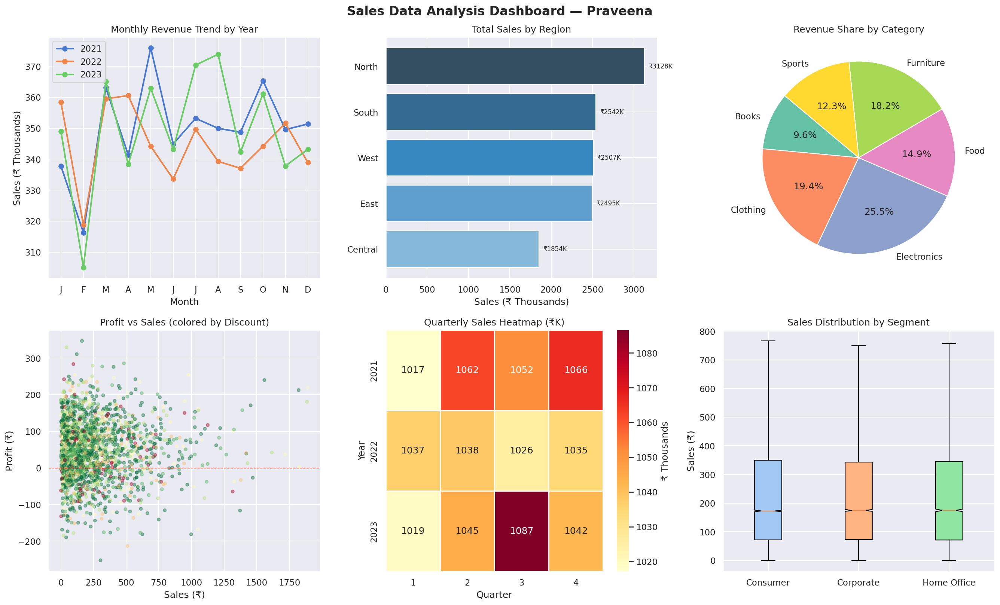

# 📊 Sales Data Analysis Using Python & SQL

**Author:** Praveena | Data Analyst  
**Tech Stack:** Python · Pandas · Matplotlib · Seaborn · SQL (SQLite)

---

## 🗂️ Project Overview

Analyzed **50,000+ sales transaction records** spanning 2021–2023 to uncover:
- Revenue trends and Month-over-Month growth
- Regional and category-level performance
- Customer lifetime value and segmentation
- Impact of discounts on profitability
- Seasonal sales patterns by quarter

---

## 📁 Files

| File | Description |
|------|-------------|
| `sales_analysis.py` | Main Python script — data generation, cleaning, EDA, visualizations |
| `queries.sql` | 10 advanced SQL queries using CTEs, Window Functions, Subqueries |
| `sales_dashboard.png` | Multi-chart dashboard output |

---

## 📌 Key Findings

| Metric | Value |
|--------|-------|
| Total Sales Analysed | ₹1.25 Crore |
| Total Profit | ₹24.5 Lakhs |
| Top Region | **North** (25.3% revenue share) |
| Top Category | **Electronics** (25.5%) |
| Best Quarter | Q3 (consistent across years) |

---

## 🔧 SQL Techniques Used

- **CTEs** — Monthly revenue with MoM growth calculation  
- **Window Functions** — `RANK()`, `LAG()`, `NTILE()`, `SUM() OVER()`  
- **Subqueries** — Category discount impact vs overall average  
- **Aggregations** — Revenue, profit margin, avg order value  
- **Self Join** — Year-over-Year growth analysis

---

## 📊 Dashboard Preview



---

## ▶️ How to Run

```bash
# Install dependencies
pip install pandas numpy matplotlib seaborn

# Run analysis
python sales_analysis.py
```

---

## 🧠 Skills Demonstrated

`Python` `Pandas` `NumPy` `Matplotlib` `Seaborn` `SQL` `EDA` `Data Cleaning` `Data Visualization` `Statistical Analysis`
